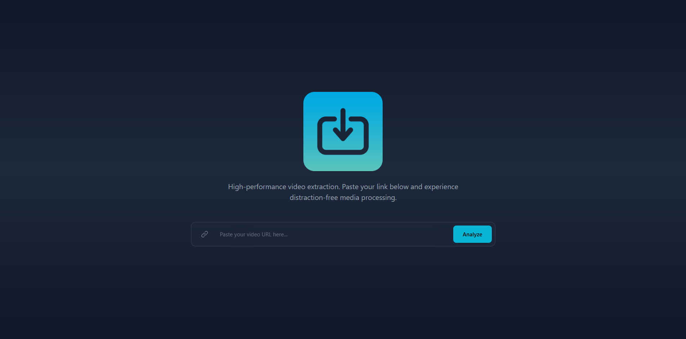
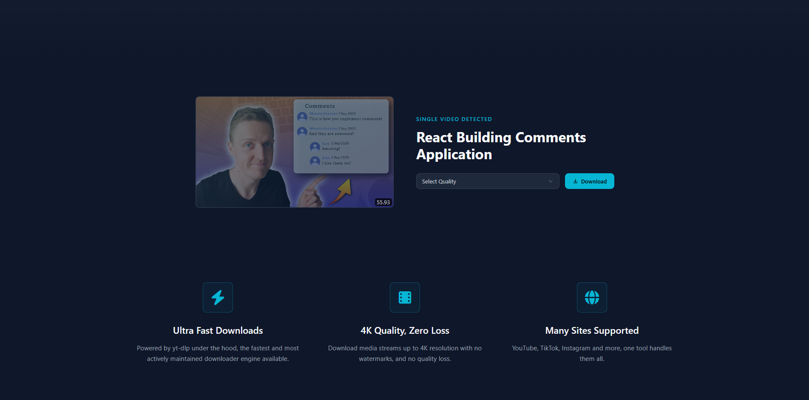
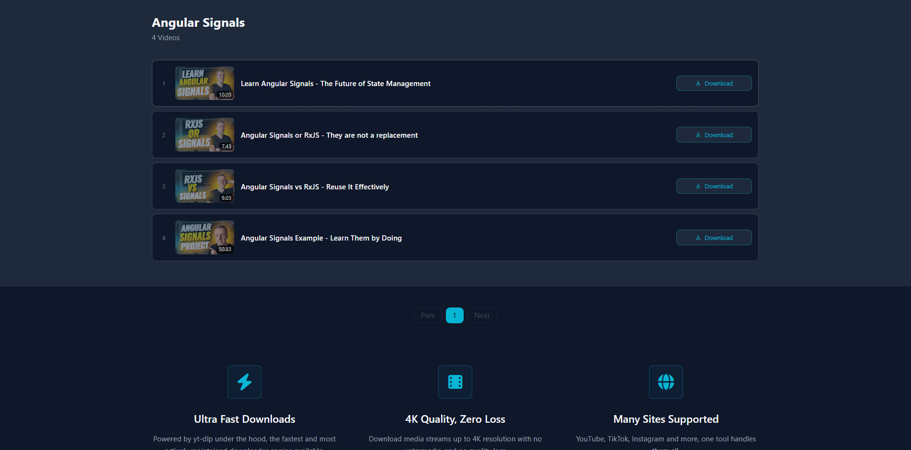
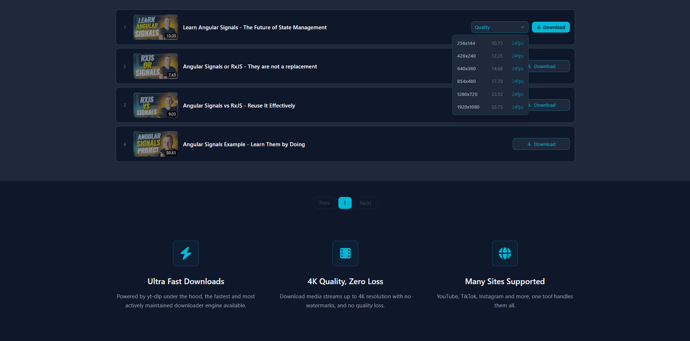

# Video Downloader

A modern, fast video downloader web app powered by **yt-dlp** — supports single videos and full playlists with quality selection up to 4K.



---

## Features

- **Single Video Download** — paste any URL, pick your quality, download instantly
- **Playlist Support** — browse and download individual videos from any playlist
- **Quality Selector** — choose from all available formats including resolution, size, and FPS
- **Private & Secure** — no data logging, sandboxed processing per request

---

## Screenshots

### Single Video



### Playlist



### Quality Selector



---

## Tech Stack

| Layer             | Technology        |
| ----------------- | ----------------- |
| Frontend          | Angular 21        |
| Styling           | Tailwind CSS      |
| Icons             | Font Awesome      |
| Backend           | Node.js           |
| Downloader Engine | yt-dlp and FFmpeg |

---

## Getting Started

### Prerequisites

- Node.js 20+
- Angular CLI 21

### Installation

**1. Clone the repository**

```bash
git clone https://github.com/mohamed-khalifa2/video-downloader.git
cd video-downloader
```

**2. Install frontend dependencies**

```bash
cd frontend
npm install
```

**3. Install backend dependencies**

```bash
cd backend
npm install
```

**4. Start the backend**

```bash
cd server
npm run dev
```

**5. Start the frontend**

```bash
cd client
ng serve
```

Open [http://localhost:4200](http://localhost:4200) in your browser.

---

## Usage

### Download a Single Video

1. Paste a video URL into the input field
2. Click **Analyze** and wait for formats to load
3. Select your preferred quality from the dropdown
4. Click **Download**

### Download from a Playlist

1. Paste a playlist URL and click **Analyze**
2. Browse the paginated list of videos
3. Click **Download** on any video to analyze its formats
4. Select quality and download

---
